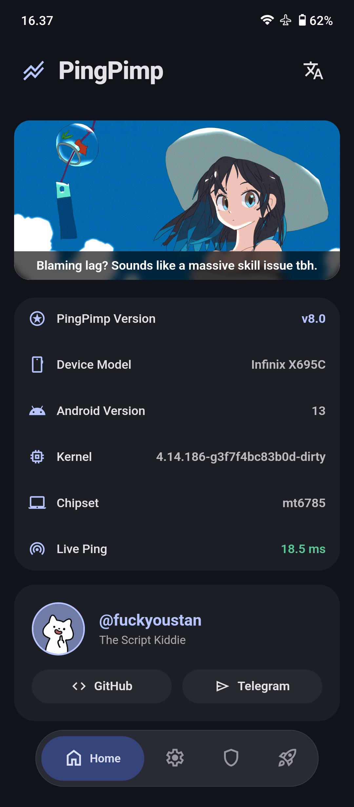
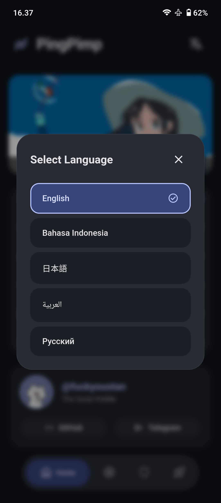
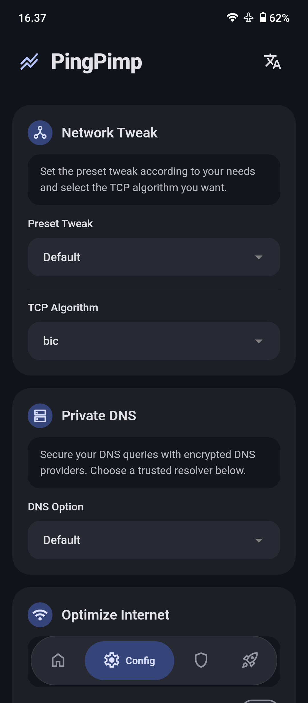
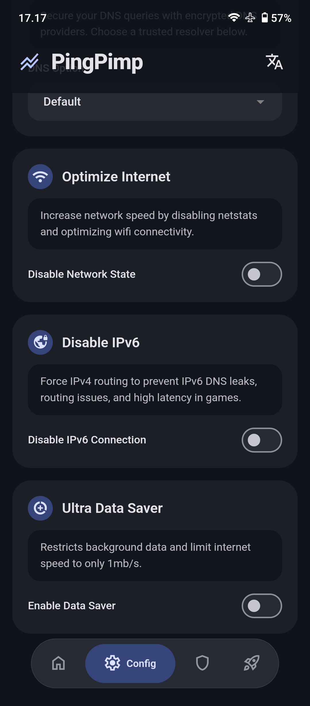
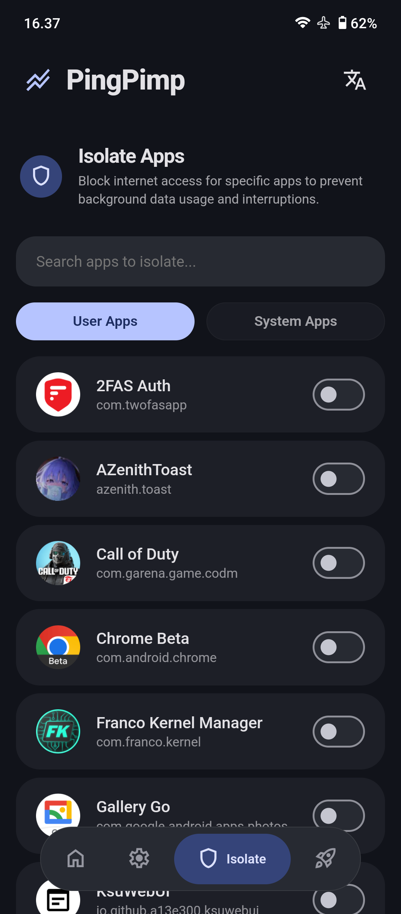
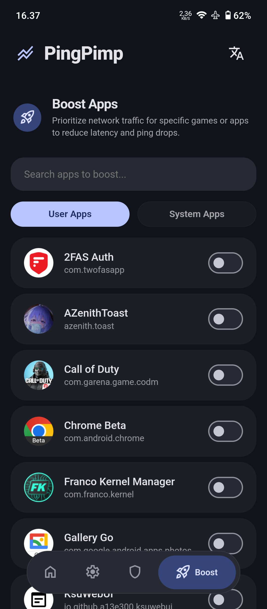

# ⚡ PingPimp
**The Ultimate Android Network Alchemist for Gamers & Power Users.**

*Stop blaming the lag. It's time to take absolute control of your connection.*

---

## 🤔 Why PingPimp?
Let's be honest: 90% of Android "network optimizer" modules out there are just placebo scripts that blindly inject random values into your `sysctl.conf` and hope for the best. 

**PingPimp is different.** We don't believe in blind tweaks. We believe in giving *you* the wheel. PingPimp bridges the gap between hardcore Linux networking commands (`iptables`, `ip6tables`, DSCP/TOS routing) and a gorgeous, user-friendly interface. Whether you are a hardcore gamer experiencing sudden ping spikes or a power user trying to save battery and data, PingPimp molds your network exactly how you want it.

## ✨ Key Features

PingPimp is packed with real, measurable network manipulation tools accessible via a clean **Material You 3 WebUI**:

* 🎮 **Turbo Boost (Packet Prioritization)**
    Give your favorite games the VIP lane. PingPimp uses `iptables` to tag your game's traffic (DSCP/TOS), ensuring your router and kernel process your game packets before anything else. Say goodbye to ping drops during a clutch.
* 🚫 **App Jail (Isolate Mode)**
    Sneaky background apps eating your bandwidth? Not anymore. Cut off internet access to specific user or system apps entirely with a single toggle. 
* 🎛️ **TCP & Network Wizards**
    Easily switch your TCP Congestion Control algorithms to match your current needs. Comes with curated presets (Game, Streaming, Download, Browsing) that actually work.
* 🛡️ **Private DNS Lounge**
    Secure your queries and bypass restrictions. Choose from our massive, built-in list of top-tier encrypted DNS providers (Cloudflare, AdGuard, Quad9, etc.), or easily set up your own Custom DNS.
* 🚀 **IPv6 Nuke & Netstat Optimizer**
    Force IPv4 routing to prevent IPv6 DNS leaks and routing overheads that cause latency spikes in-game.
* 🌍 **Multi-Language Support**
    Speaks your language! Fully translated into English, Indonesian, Japanese, Arabic, and Russian with fun, humanized localization.

## 🥊 PingPimp vs The Rest

| Feature | PingPimp ⚡ | Other Modules 🐢 |
| :--- | :--- | :--- |
| **Interface** | Gorgeous Material You WebUI | Terminal / Volume Keys only |
| **App Targeting** | Yes (Select specific apps to boost/isolate) | No (Applies globally, causing instability) |
| **Mechanism** | Real `iptables` & Kernel-level routing | Placebo `build.prop` edits |
| **Flexibility** | Change tweaks on the fly | Requires rebooting every time |

## 📸 Sneak Peek (WebUI)

  
  

  
  

  
  

## ⚙️ Installation

PingPimp requires a rooted Android device (Android 10+).

1. Download the latest `PingPimp-vX.X.zip` from the [Releases](../../releases) page.
2. Open your Root Manager (**KernelSU**, **Magisk**, or **APatch**).
3. Go to the Modules tab and select `Install from storage`.
4. Flash the `.zip` file and reboot your device.
5. **How to use:** Open your Root Manager app, go to the Modules section, and tap on **PingPimp** to open the WebUI dashboard.

## 🛠️ Compatibility
* **Root:** KernelSU (Recommended for WebUI), Magisk, or APatch.
* **OS:** Android 10 and above.
* **Architecture:** ARM64

## 💬 Community & Support
Got a question, bug report, or just want to hang out with fellow flashaholics? Join our community:

## ⚠️ Disclaimer & Credits
PingPimp messes with core Linux networking tables. While it is designed to be completely safe and reversible (just uncheck a toggle or uninstall the module), I am not responsible for thermonuclear wars, missed alarms, or you getting banned from your favorite game (though you won't, because we don't touch game files).

    
Crafted with ❤️ and too much caffeine by [@fuckyoustan](https://github.com/fuckyoustan).

---

  <b>If PingPimp helped you win your matches, don't forget to drop a ⭐ on this repository!</b>

